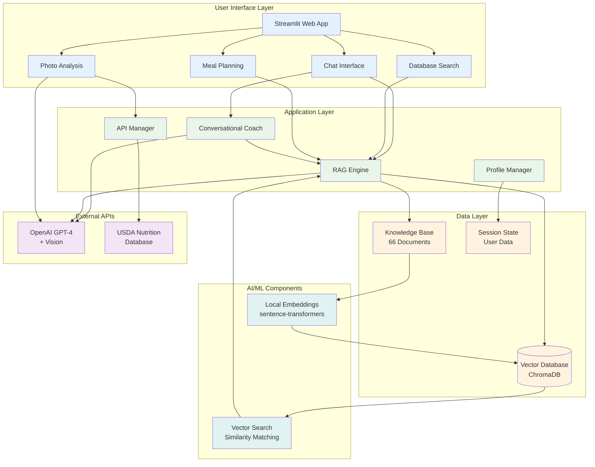
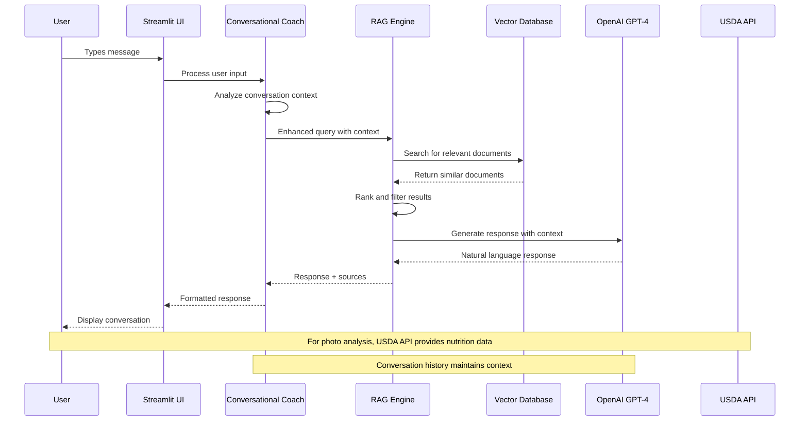
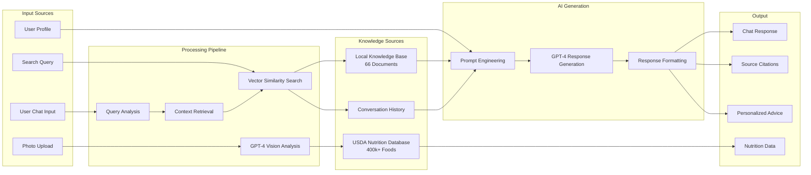
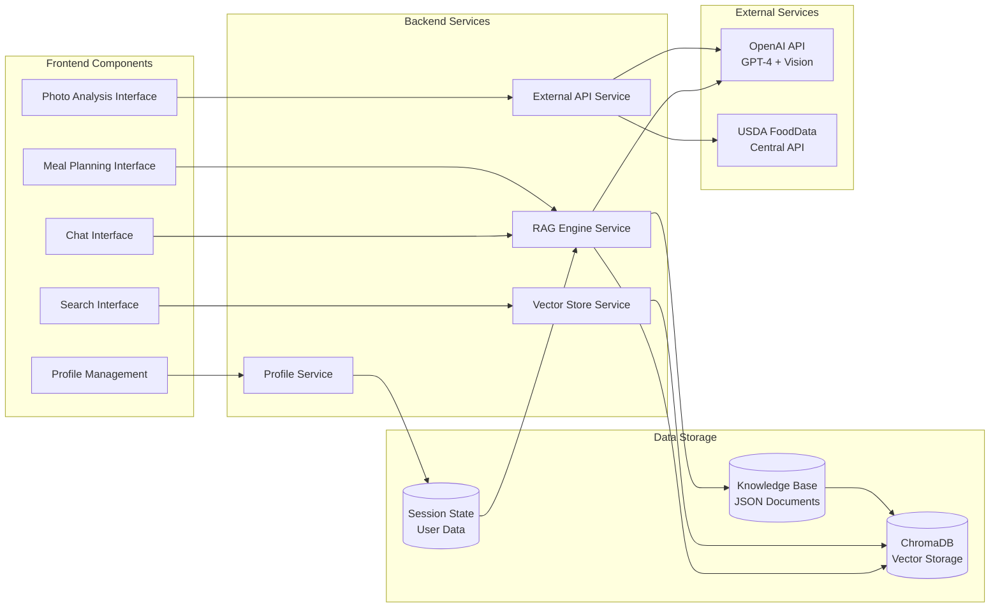

# System Architecture - Nutrition Tutor Bot

## High-Level Architecture Diagram

## RAG Pipeline Architecture

## Data Flow Architecture

## Component Interaction Diagram

## Technology Stack Overview

### Core Technologies
- **Python 3.11**: Backend development
- **Streamlit**: Web application framework
- **OpenAI GPT-4**: Language model and vision AI
- **ChromaDB**: Vector database for document storage
- **Sentence Transformers**: Local embedding generation

### AI/ML Libraries
- **LangChain**: RAG pipeline components
- **sentence-transformers**: Text embedding generation
- **NumPy**: Numerical computations
- **Pandas**: Data manipulation

### Integration APIs
- **OpenAI API**: Chat completions and vision analysis
- **USDA FoodData Central**: Real-time nutrition data
- **RESTful Architecture**: Standard API communication

### Development Tools
- **pytest**: Automated testing framework
- **python-dotenv**: Environment variable management
- **Pillow**: Image processing for photo uploads
- **JSON**: Data serialization and storage

## Performance Characteristics

### Response Times
- **Vector Search**: ~10ms average
- **RAG Pipeline**: ~12.5 seconds average
- **Photo Analysis**: ~5-8 seconds
- **Database Queries**: <100ms

### Scalability Considerations
- **Local Embeddings**: No API costs for search
- **Session-based Storage**: Minimal server requirements
- **Stateless Architecture**: Easy horizontal scaling
- **Modular Design**: Components can be upgraded independently

### Resource Requirements
- **Memory**: ~500MB for embedding model + database
- **Storage**: ~100MB for knowledge base and embeddings
- **Network**: API calls only for LLM generation and nutrition lookup
- **CPU**: Moderate for local embedding generation

## Security Architecture

### Data Protection
- **Environment Variables**: Secure API key storage
- **Session Isolation**: User data isolated per session
- **No Persistence**: Sensitive data not permanently stored
- **Local Processing**: Embeddings generated locally

### API Security
- **Key Management**: Environment-based configuration
- **Rate Limiting**: Handled by external service providers
- **Error Handling**: Graceful fallbacks for API failures
- **Input Validation**: User input sanitization

### Privacy by Design
- **Minimal Data Collection**: Only necessary information stored
- **Transparent Processing**: User aware of data usage
- **User Control**: Profile editing and deletion capabilities
- **Session Cleanup**: Automatic data clearing on session end